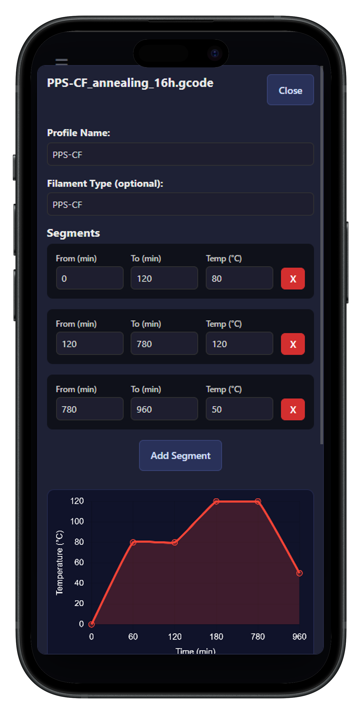
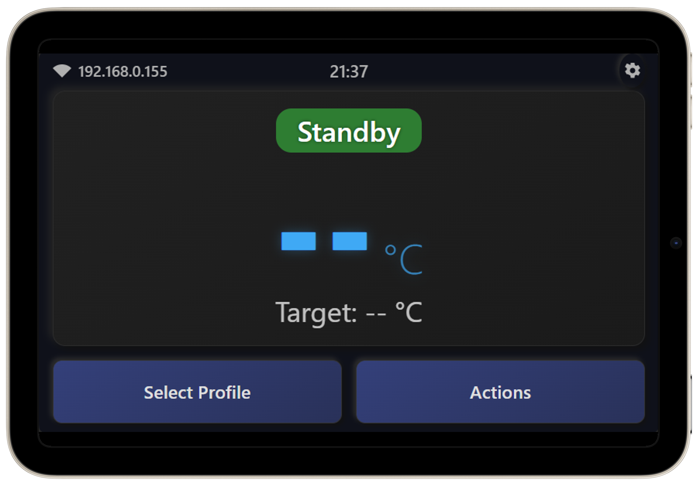

# 🍕 Klipper PIZZA Oven 🍕

A modern, responsive, and user-friendly web interface for controlling a DIY Oven with Klipper firmware, specially adapted for annealing 3D printed parts and drying filaments or for use as a "pizza oven".

The application is built on a **FastAPI** backend and communicates with Klipper via the **Moonraker API**.

---

| Desktop | Mobile | Display with browser in kiosk mode |
| :---: | :---: | :---: |
|  |  |  |

---

## ✨ Key Features

* **🖥️ Dashboard:** Monitor the oven's temperature, program progress, and see a G-code preview in real-time. Includes controls for pausing, resuming, and canceling processes.
* **📂 Profile Management:** Easily create, manage, and start custom heating profiles for both multi-segment annealing and single-temperature filament drying.
* **📈 Interactive Charts:** Get a visual preview of the temperature curve during profile creation and monitor live temperature data on the dashboard.
* **⌨️ Console:** Send G-code commands directly to Klipper and view real-time responses in the console log.
* **📱 Fully Responsive & Touch-Friendly:** Control your oven from any device—desktop, mobile or display with browser in kiosk mode. Includes a dedicated full-screen interface (/display) for small touchscreens.
* **📝 File Manager & Editor:** A built-in editor on the "Machine" page allows you to create, edit, and delete Klipper configuration files (printer.cfg, macros, etc.) directly from the web interface.
* **⚙️ Machine & System Management:** View system vitals like CPU temperature and memory usage, manage Klipper/Moonraker updates, and install the required Klipper module with a single click.

---

## 🚀 Roadmap & Future Plans

This project is actively developed. Here are some of the features and improvements planned for the future:

* Temperature Units: Add a setting to switch between Celsius and Fahrenheit.

* Language Localization: Add support for multiple languages (e.g., German, Czech).

* Job History: Log and review past cycles, including a chart of the actual temperature curve.

* Simplified Installation: Create an installation script and package the application as a Moonraker extension for easy setup.

* Theme Switching: Implement a light theme and a high-contrast mode.

* And much more...

---

## 🛠️ Tech Stack

* **Backend:** Python 3, FastAPI, Uvicorn, Jinja2
* **Frontend:** HTML5, CSS3, Vanilla JavaScript (ES6+)
* **Visualization:** Chart.js
* **Code Editor:** CodeMirror
* **Klipper Communication:** Moonraker API

---

## 🤝 Contributing

Have an idea for an improvement or found a bug? Feel free to create an *Issue* or send a *Pull Request*. All contributions are welcome!

---

## 🙏 Acknowledgements

A special thank you to user voidtrance for writing the initial pizza_oven.py Klipper module.

Huge thanks to everyone on the Voron Discord server for their continuous help and support.

---

## 📄 License

This project is licensed under the **GNU General Public License v3.0**. For more information, see the [LICENSE](LICENSE) file.

---

❤️ Support My Work
If you like this project and find it useful, please consider supporting me. A small donation helps me dedicate more time to maintaining this project and developing new features. Every contribution is highly appreciated!

